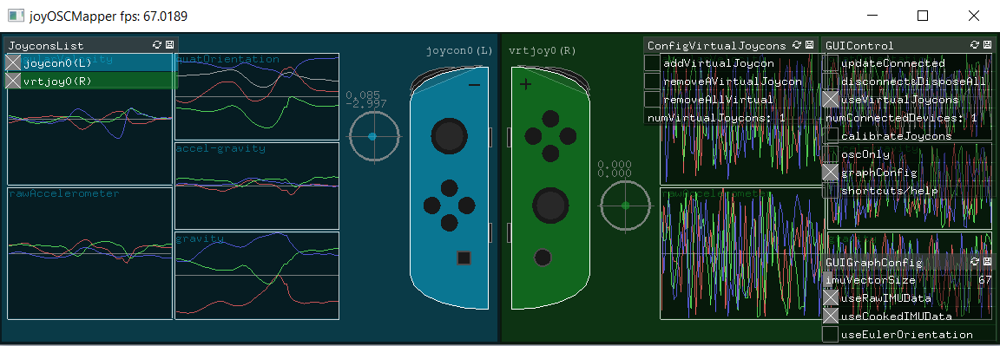
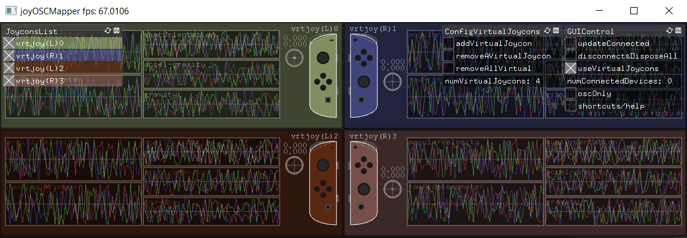
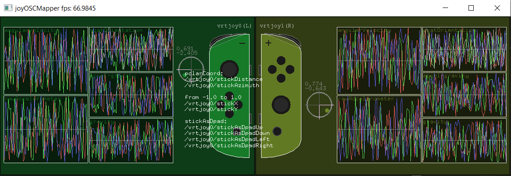

# joyOSCMapper
**joyOSCMapper** is suposed to be a easy way to visualize and map joycon inputs (buttons, stick and motion) as [OSC](http://opensoundcontrol.org/introduction-osc) messages, allowing to use and test joycon inputs to control "anything" controlable with OSC. Therefore, this software idea is a simple central program to use joycons with Interactive Music Systems and other art related contexts. 

It is being built with C++/[openFrameworks](https://openframeworks.cc/) and uses JibbSmarts' [JoyShockLibrary](https://github.com/JibbSmart/JoyShockLibrary) to gather the data from the joycons via Bluetooth and the _ofxOsc_ addon to convert the data in OSC messages. I'm developing it using a Windows 10, with Visual Studio 2017, but, as its built with openFrameworks, it should be easy enough to use it in any OS that runs this C++ toolkit.



## Contents
* **[Releases](#releases)**
* **[Usage for devs](#usage-for-devs)**
* **[OSC data sent](#osc-data-sent)**
* **[Basic functionalities](#basic-functionalities)**
  * **[Connecting joycons](#connecting-joycons)**
  * **[Calibration](#calibration)**
  * **[JoyconsList](#joyconslist)**
  * **[Motion graphs](#motion-graphs)**
* **[Other functionalities](#other-functionalities)**
  * **[Virtual Joycons](#virtual-joycons)**
  * **[oscOnly mode](#oscOnly-mode)**
  * **[Mouse clicks](#mouse-clicks)**
  * **[Get joycon type and color](#get-joycon-type-and-color)**
  * **[Shortcuts/Help](#shortcutshelp)**
* **[Default values](#default-values)**
* **[Important notes](#important-notes)**
* **[Future implementations](#future-implementations)**
* **[Last words/contact](#last-wordscontact)**
* **[License](#license)**

## Releases
The releases of **joyOSCMapper** can be found [here](https://github.com/cacaiocamp/joyOSCMapper/releases). The only dependency to run the application is the Visual C++ Redistributable package for Visual Studio 2017, that can be found [here](https://docs.microsoft.com/en-us/cpp/windows/latest-supported-vc-redist?view=msvc-170).

## Usage for Devs
With the openFrameworks already downloaded for your IDE, you will first need to build a .dll of JoyShockLibrary for your OS. If you are using a x64 Windows, the .dll and .lib files in the _libs/_ folder are already the right ones. If x86, you can get the [latest x86 release of JoyShockLibrary](https://github.com/JibbSmart/JoyShockLibrary/releases).

After that, all the files you need are on the _src/_ folder. You will also need to make the link of your project/solution to the folder where the .dll and .lib files are and a openFrameworks app with _ofxOsc_ and _ofxGUI_ addons imported.

For Visual Studio users, the full solution is also provided.

## OSC data sent
**joyOSCMapper** takes advantage of most of JoyShockLibrary's functionalities for joycons, mapping buttons, sticks, raw motion (gyroscope and accelerometer) and sensor fusion (orientation in quaternions, acceleroremeter without the effect of gravity and isolated gravity). I also implemented the stick data as polar coordinates and as dpad, as well as a conversion from quaternion to euler orientation. This data is collected, drawn in real time and sent via OSC. 

The full list of the default input OSC tags follows (the name of the buttons are composite to represent both left and right joycons): 
```
struct inputOSCTags
{
	string upX = "/upX";
	string downB = "/downB";
	string leftY = "/leftY";
	string rightA = "/rightA";
	string minusPlus = "/minusPlus";
	string zlzr = "/zlzr";
	string lr = "/lr";
	string printHome = "/printHome";
	string stickClick = "/stickClick";
	string sr = "/sr";
	string sl = "/sl";

	string stickX = "/stickX";
	string stickY = "/stickY";
	string stickDistance = "/stickDistance";
	string stickAzimuth = "/stickAzimuth";
	string stickAsDpadUp = "/stickAsDpadUp";
	string stickAsDpadDown = "/stickAsDpadDown";
	string stickAsDpadLeft = "/stickAsDpadLeft";
	string stickAsDpadRight = "/stickAsDpadRight";

	string gyroX = "/gyroX";
	string gyroY = "/gyroY";
	string gyroZ = "/gyroZ";
	string raclX = "/raclX";
	string raclY = "/raclY";
	string raclZ = "/raclZ";

	string quatW = "/quatW";
	string quatX = "/quatX";
	string quatY = "/quatY";
	string quatZ = "/quatZ";
	string caclX = "/caclX";
	string caclY = "/caclY";
	string caclZ = "/caclZ";
	string gravX = "/gravX";
	string gravY = "/gravY";
	string gravZ = "/gravZ";

	string roll = "/roll";
	string pitch = "/pitch";
	string yaw = "/yaw";
};
```

The full input OSC messages are composed with the name of the joycon (/joycon+0..n, based on the order of connection) added with the OSC tag of the input pressed, followed by the argument with the value of the input. So, for example, if I press the up/X button on the first joycon connected the full OSC message sent will be ```/joycon0/upX 1.0```.

With the exception of the motion data, all OSC messages are sent only when a change on the input value occurs. The joycons are updated in a 66.67hz frequency, receiving the latest state for all inputs every 15ms. Therefore, thats the same rate in which **joyOSCMapper** can send OSC messages and the ideal fps for the aplication (rounded up to 67).

By default, **joyOSCMapper** sends OSC messages to ```127.0.0.1``` (localhost), to the port ```11111```.

## Basic functionalities
### Connecting joycons
You only need to connect the joycons over bluetooth to your computer than execute **joyOSCMapper** and the program should manage to connect to them, automaticaly starting to draw them and to send their respective OSC messages. You can also use two _ofxButton_ on GUIControl, ```updateConnected``` and ```disconnect&DisposeAll```, to manipulate joycon connections, as well as a _ofxLabel_ with the number of connected joycons.

### Calibration
JoyShockLibrary also provides some functions to calibrate the joycon motion data. This is recommended to be done every time **joyOSCMapper** aplication is restarted. To do so, as said in [JoyShockMapper](https://github.com/JibbSmart/JoyShockMapper), you must:
* Place all the real connected joycons on a still surface;
* Toggle ```calibrateJoycons``` on GUIControl;
* Wait a couple of seconds and untoggle the ```calibrateJoycons```;

### JoyconsList
JoyconsList is a _ofxPanel_ GUI that has a toggle for every connected joycon. You can un/toggle the drawing and the OSC messages of each one.

### Motion graphs
The graphs show a collection (by default, the collection of the last second values) of each IMU data collected, in all axes. The color pattern for each axis is: 
* x = red
* y = green
* z = blue
* w = white (used on the quaternion orientation)

If you want to use the orientation in euler angles instead of the quaternion one provided by JoyShockLibrary, toggle ```useEulerOrientation``` on GUIGraphConfig. The quaternion to euler orientation convertion is made with [_ofQuaternion.getEuler()_](https://github.com/openframeworks/openFrameworks/blob/master/libs/openFrameworks/math/ofQuaternion.cpp) function.

It is also possible to un/toggle the use of raw and cooked IMU graphs on GUIGraphConfig, as well as change the size of the graphs with the ```imuVectorSize``` _ofxSlider_. Note that increasing the graphs size too much may cause fps drop, depending also on the number of joycons being drawn.

## Other functionalities
### Virtual joycons
Virtual joycons are fake joycons used to test **joyOSCMapper** and its interaction with other programs even when without a joycon. Their motion data is randomized every frame, and stick and buttons can be manipulated with mouse clicks, sending respective OSC messages when ```useVirtualJoycons``` is toggled on the GUIControl. For example, when you left click at the up/X button of the first added virtual joycon, the OSC message sent will be ```/vrtjoy0/upX 1.0```.

Toggling ```useVirtualJoycons``` will open another _ofxPanel_ GUI, where you can control/manage the addition and removal of virtual joycons, as well as see the number of virtual joycons created. Virtual joycons also have toggles on JoyconsList.


### oscOnly mode
When toggled, the oscOnly mode will stop all joycon drawing but will continue to send the OSC messages for the inputs made. You can either un/toggle them by clicking the toggle ```oscOnly``` on GUIControl or sending an OSC message to the address ```/oscOnly```, with 0 or 1 as argument.

By default, **joyOSCMapper** waits for OSC messages at the port ```22222```.

### Mouse clicks
Right mouse clicks will show the respective OSC address for the input clicked, as well as the range of values for non boolean inputs. The left clicks will activate joycons buttons and stick on virtual joycons, while doing the same as right clicks on real connected joycons.


### Get joycon type and color
By sending a OSC message with the tag ```/getJoyconTypeAndColor``` followed by the index of a joycon (that can be checked on JoyconsList) as an integer argument, you can get the type and color of a disered joycon, that will be sent as a single OSC message. The type is sent as an integer (```1``` for left and ```2``` for right, following JoyShockLibrary definitions) and the color as a string containing a hexadecimal, following the RGB pattern.

This OSC message will be sent to the osc send address and is composed by the name of the joycon (/joycon+0..n, based on the order of connection) added with the OSC tag ```/sendJoyconTypeAndColor``` and followed by the type and color, respectvely. 

For example, if I wanted to get the type and color of the first connected joycon, I would send to **joyOSCMapper** the following OSC message: ```/getJoyconTypeAndColor 0```. Considering this is a left and non-virtual white joycon (white in RGB is ```255, 255, 255```), **joyOSCMapper** would send back the following message ```/joycon0/sendJoyconTypeAndColor 1 ffffff```.

### Shortcuts/Help
The shorcuts/help can be un/toggled on the GUIControl. It will show the keyboard shorcuts implemented, as well as the color information for the graphs. All other GUIs can also be un/toggled, with the proper shortcuts.

## Default values
The following default values definitions can be found on _sharedDefs.h_:
```
#define DEFAULT_OSCSEND_ADDRESS "127.0.0.1"
#define DEFAULT_OSCSEND_PORT 11111
#define DEFAULT_OSCRECEIVE_PORT 22222
#define DEFAULT_OSCONLY_OSCADDRESS "/oscOnly"
#define DEFAULT_GETJOYCONTYPEANDCOLOR_OSCADDRESS "/getJoyconTypeAndColor"
#define DEFAULT_SENDJOYCONTYPEANDCOLOR_OSCADDRESS "/sendJoyconTypeAndColor"
#define DEFAULT_IMUVECTORSSIZE 67 //_n1
#define DEFAULT_MINSTICKSTEP 0.0035 //_n2
#define DEFAULT_MINSTICKASDPADDIST 0.2 //_n3
```
For now, the only way to change default values is modifying those definitions. The last three deserve some coments:
* change ```DEFAULT_IMUVECTORSSIZE``` if you want to change the range of the _imuVectorSize_ slider on GUIGraphControl. The values of the slider range from ```DEFAULT_IMUVECTORSSIZE / 2``` to ```10 * DEFAULT_IMUVECTORSSIZE```;
* change ```DEFAULT_MINSTICKSTEP``` if you are having any issues with stick precision. The stick values reported are diferent almost every single report, ```Joycon.minStickStep``` represent the minimum stick variation to trigger stick OSC messages and drawing changes;
* ```Joycon.minStickAsDpadDist``` represent the minimum _stickX_ and _stickY_ distance from the center to trigger _stickAsDpad_ values. For example, with the ```DEFAULT_MINSTICKASDPADDIST``` at ```0.2```, you need to have ```stickX >= 0.2``` to trigger ```stickAsDpad.right 1``` and ```stickX < 0.2``` to retrigger ```stickAsDpad.right 0```.

Check [Future implementations](#future-implementations) section to see the plan to make those and other changes more dynamic.

## Important notes
**joyOSCMapper** will allow any number of joycons to be connected (as well as any number of virtual joycons to be created), trying to respond to their inputs on joycons data update rate, **every 15ms/66.67hz**. But, as noted on [this](https://github.com/JibbSmart/JoyShockLibrary#known-and-perceived-issues) part of JoyShockLibrary's README.md: "Some Bluetooth adapters can't keep up with these devices [joycons], resulting in laggy input. This is especially common when more than one device is connected (such as when using a pair of JoyCons). There is nothing JoyShockMapper or JoyShockLibrary can do about this.".

About that, I made some tests comparing the time response of the first connected joycon (theoretically with no lag) to other ones (second and third). Each test was made of 500 input changes (250 button presses per test, considering that the input also changes when you release the button) and I made it 6 times (totalizing 3000 input changes):
* 3 with only 2 joycons connected, resulting in the following avarage lags (in ms): ```138.41```, ```144.958``` and ```116.914```;
* 2 with 3 joycons connected, testing lag between first and third, with avarage lags (in ms):  ```113.678``` and ```115.776```;
* 1 with 3 joycons connected, testing lag between first and second, with avarage lag (in ms): ```120.138```;

The overall test result shows an avarage lag of ```124.979 ms``` between the first and other connected joycon inputs, considering the first one without any lag. The test also **suggests** that, after the first one, _it doesn't really matter the order or the number of joycons connected, the lag will be quite the same_. I can't confirm that though, as I don't have any more joycons.

It's also worth to notice that trying to draw too many joycons may result in a fps drop and that may cause more laggy inputs/OSC messages. For those cases (or any other reason to fps drop), the use of _oscOnly mode_ is recomended.

Also, comments have been added to the code in a way similar to a "foot note". A line with a comment ```_nX```, with X being any natural number, indicates that in the bottom of this file there is a foot note, with the same name, about the indicated line. I tried to put as less comments as possible, as a way to force me to write the better understandble code I could.

## Future implementations
Not counting the standalone app, I plan to implement two types of configurations: a general config, and a individual config for each joycon. The ideia here is to let drawing and OSC be configured accordingly to user necessities, changing things like:
* un/toggle the use/draw raw and/or cooked graphs
* change osc address, port and tags
* change minStickStep
* un/toggle the use stick as D-pad/polar coordinates
* change minStickAsDpadDist
* change IMUVectorsSize
* save and load preferences

## Last words/contact
This is my first public repository and I might have done something wrong with it, sorry in advance for that! 

I made this program as a way to study openFrameworks and make something that I thought might be usefull (for me and other people). So please, feel free to open issues if you find any bug or want make a sugestion. For any other kind of contact, regarding doubts, comments or if you are using **joyOSCMapper** and wanna hit me up for a chat, also feel free to contact me by [email](https://github.com/cacaiocamp).

Last, I'd also like to give credits to [JoyShockLibrary](https://github.com/JibbSmart/JoyShockLibrary) developers, as this program mainly depends on it to work.

## License
**joyOSCMapper** is licensed under the MIT License - see [LICENSE.md](https://github.com/cacaiocamp/joyOSCMapper/blob/master/LICENSE.md).
